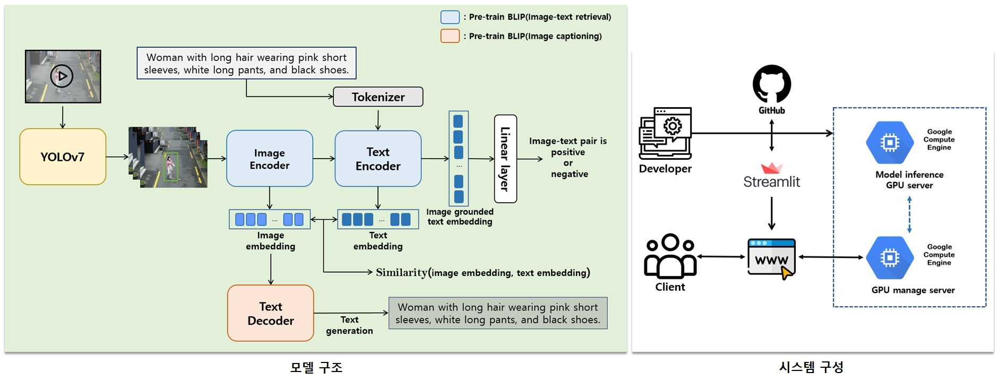
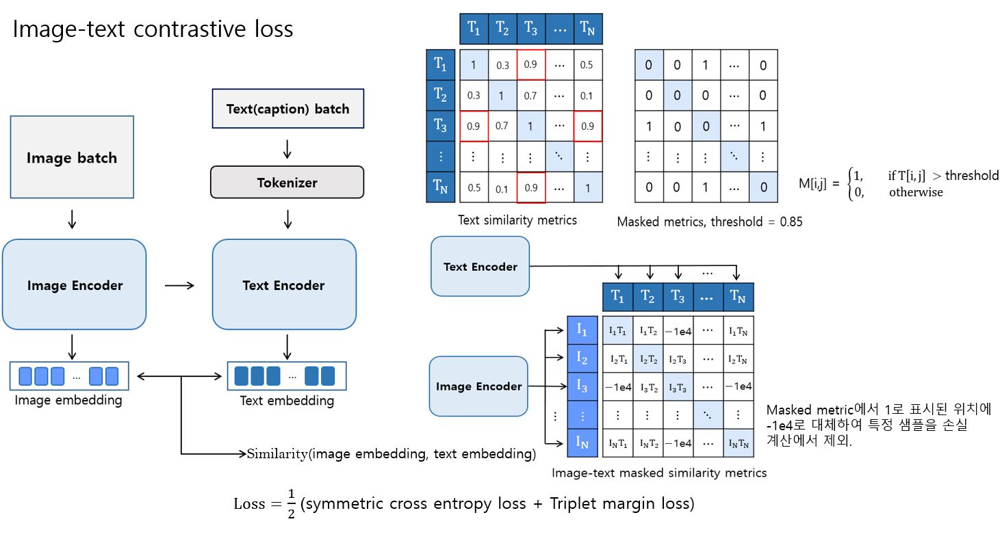
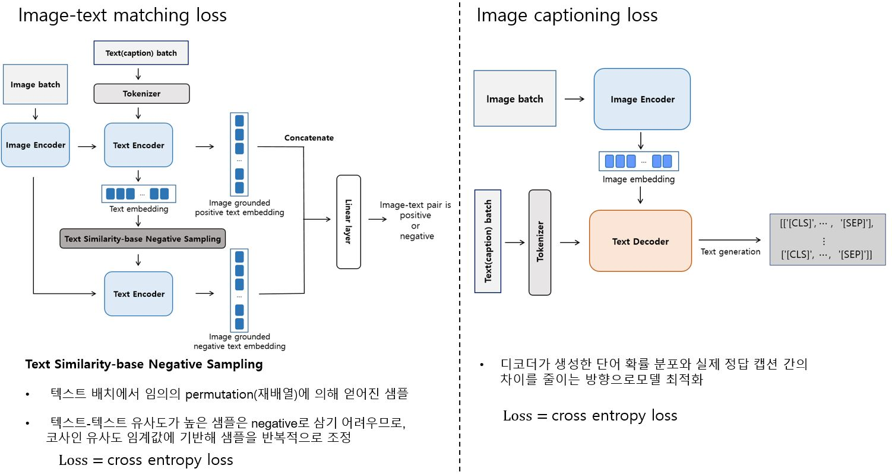
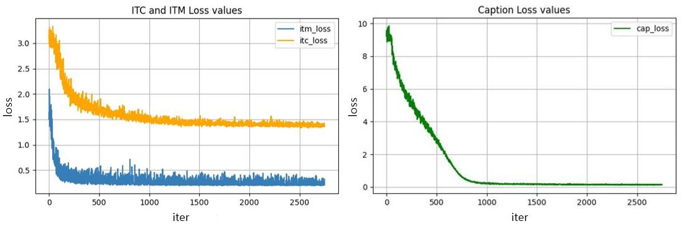
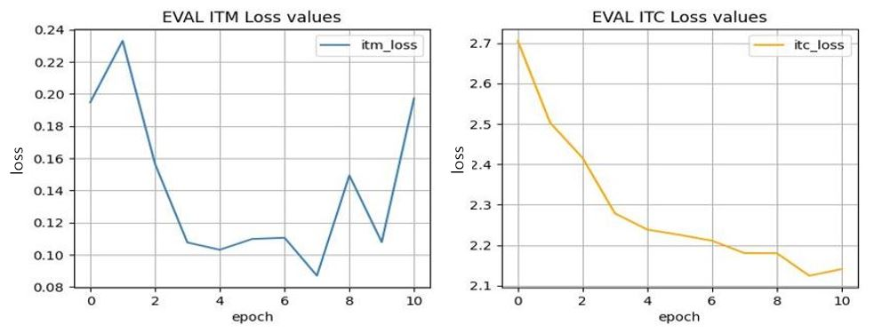
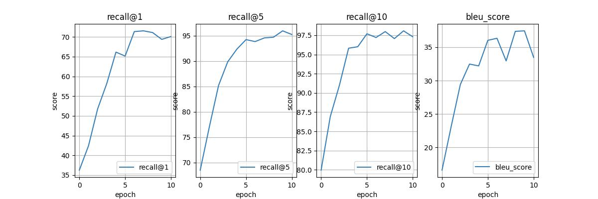

## CCTV 기반 의류 분석 및 검색 시스템
### 프로젝트 목적
이 프로젝트는 딥러닝을 활용한 CCTV 영상 분석을 통해 특정 인물의 복장과 관련된 정보(색상, 스타일 등)를 텍스트로 입력받아
입력된 설명과 유사한 복장을 입은 사람을 탐지 및 분석하는 시스템으로, 주로 보안, 패션 분석, 고객 행동 연구와 같은 다양한 응용 분야를 목표로 설계되었습니다. 
이를 통해 대규모 영상 데이터에서 특정 조건에 맞는 대상을 효율적으로 탐색하고, 보안 및 관찰 작업에서의 작업 시간을 대폭 단축할 수 있습니다.

### 프로젝트 동기 
CCTV가 설치된 환경에서 특정 대상을 찾는 작업은 시간이 많이 소요되고, 사람이 직접 모든 영상을 검토해야 하는 경우가 많습니다. 특히 복장과 같은 세부 정보를 기준으로 대상을 찾는 것은 비효율적이며, 오류가 발생하기 쉽습니다.
따라서, 복장 정보를 기반으로 특정 인물을 탐지하는 자동화된 시스템은 다음과 같은 이유에서 필요합니다.
1. 보안 및 감시 업무에서의 효율성 향상
2. 실시간 모니터링과 빠른 검색 요구를 충족
3. 사람의 주관적 판단이 아닌 데이터 기반의 객관적 결과 제공
<br>  
<p align="left">

</p>  

## 주요 기능 
이 프로젝트의 주요 기능은 다음과 같습니다.  
  1. 텍스트 기반 의상 설명 입력  
    - 사용자는 특정 인물의 복장 특징(예: "검은 셔츠, 청바지, 흰 운동화")을 텍스트로 입력할 수 있습니다.

  2. CCTV 영상 분석 및 대상 탐지  
    - **YOLOv7** 기반의 객체 탐지 모델을 사용하여 영상에서 사람을 탐지합니다.

  3. 입력된 텍스트와의 유사도 계산  
    - **BLIP** 모델을 사용하여 탐지된 사람의 복장 정보와 입력된 텍스트의 유사도를 계산하고, 가장 높은 유사도를 가진 프레임을 반환합니다.

  4. 캡션 생성  
    - 높은 유사도를 가진 프레임을 대상으로 기존에 입력했던 텍스트와 비교할 수 있는 새로운 캡션을 생성합니다. 

  5. 검색 결과 제공  
    - 특정 시점의 인물을 빠르게 확인할 수 있도록 영상 분석 결과를 시간 정보와 함께 제공합니다.

  6. 웹 인터페이스  
    - Streamlit과 flask를 활용하여 직관적이고 사용하기 쉬운 인터페이스를 제공합니다.


## 기술 스택
  1. 프로그래밍 언어 및 프레임워크 - Python, PyTorch, Transformers, Flask, Streamlit
  2. 데이터 처리 - OpenCV, Pillow, NumPy
  3. 모델 아키텍처  
    - BLIP : Hugging Face의 transformers 라이브러리를 통해 사전 학습된 모델(Image-text retrieval, captioning)을 파인튜닝  
    - YOLOv7 : 공식 gitHub에 제공된 사전 학습 모델을 사용해 사람 탐지 수행
  5. 클라우드 및 배포 - GCP (Compute Engine), Streamlit Cloud


## Dataset
#### 1. [PEdesTrian Attribute (PETA) dataset](https://mmlab.ie.cuhk.edu.hk/projects/PETA.html)
- 보행자 속성 분석을 위해 제작된 데이터셋
- 속성에는 성별, 나이, 상·하의 유형 및 색상, 가방 소지 여부 등이 포함
- 19,000개 이미지와 약 61개의 속성 라벨 포함

#### 2. [DeepFashion Multi Modal dataset](https://github.com/yumingj/DeepFashion-MultiModal)
- 패션 아이템의 이미지와 텍스트 설명을 매칭한 멀티모달 데이터셋
- 패션 아이템의 색상, 패턴, 스타일 등 다양한 정보 제공
- 약 44,000개 이미지로 구성
#### 3. [유동인구 분석을 위한 CCTV영상 데이터 (AI HUB)](https://www.aihub.or.kr/aihubdata/data/view.do?currMenu=115&topMenu=100&dataSetSn=489)
- CCTV 영상을 기반으로 유동인구의 속성 분석에 적합한 데이터셋
- 개인정보 보호를 위한 비식별화 처리
- 3분 클립 6,600개(330시간) 구성

Dataset에 대한 자세한 설명은 [dataset/README.md](./dataset)에 작성되어있습니다.<br><br>  

## Model detail  
#### 1. BLIP 
- BLIP(Bootstrapped Language-Image Pretraining)는 이미지와 텍스트 간의 관계를 학습하는 멀티모달 모델
- Huggingface에서 제공하는 blip-itm-base-coco(이미지-텍스트 검색), blip-image-captioning-base(이미지 캡셔닝)을 사용
- 하나의 비전 인코더를 통해 텍스트 인코더와 텍스트 디코더에서 각각의 테스크를 수행할 수 있도록 모델을 파인 튜닝  
    (blip-itm-base-coco와 blip-image-captioning-base의 텍스트 디코더를 결합한 형태의 모델) 
- 아래의 4. Loss 항목에 기제된 3가지 loss를 결합하여 모델을 최적화하는 멀티 태스크 러닝(Multi-Task Learning) 수행
  
#### 2. YOLOv7  
- YOLOv7은 You Only Look Once (YOLO) 시리즈의 최신 모델 중 하나로, 실시간 객체 탐지에서 높은 정확도와 효율성을 제공
- 시스템 추론과정 초기에 사전학습된 YOLOv7으로 CCTV 영상에서 사람 탐지 수행

#### 3. Model summary  
  | 모델 | 	blip-itm-base-coco | blip-image-captioning-base | YOLOv7 |
  | :---: | :---: | :---: | :---: |
  | 모델 크기 | 약 223.3M 파라미터 | 약 247.4M 파라미터 | 약 36.9M 파라미터 |
  | 입력 크기 | 384x384 | 384x384 | 640x640 |
  | 비전 인코더 | ViT-base | ViT-base | - |
  | 텍스트 인코더/디코더	 | BERT (인코더) | BERT (디코더) | - |
  | 학습 데이터 | MS COCO | MS COCO | MS COCO |
  | 성능(MS COCO) | R@1: 71.8 | B@4: 38.6 | mAP@0.5: 56.8%, 161fps |
<br>

#### 4. Loss
  <p align="left">

</p> 

<p align="left">

</p><br>  

## Training result  
#### 1. Train loss
<p align="left">

</p>  

#### 2. Eval loss
<p align="left">

</p> 

#### 3. 모델 평가 밥법
BLIP 공식 구현에서 사용된 방법을 일부 채택하여 모델 평가

    1. 유사도 계산 (sims_matrix)
        - 텍스트 임베딩과 이미지 임베딩의 내적을 통해 텍스트-이미지 유사도 행렬 생성
    
    2. 상위 K개 후보 선택 (Top-K Selection)
        - 각 텍스트에 대해 이미지 유사도가 높은 상위 k개의 이미지를 선택
    
    3. 추론 및 점수 계산
        - 선택된 상위 k개의 이미지와 텍스트 쌍을 모델에 입력
        - ITM(이미지-텍스트 매칭) 점수와 유사도를 합산하여 최종 점수 행렬(score_matrix_t2i) 생성
    
    4. Recall@K 계산
        - score_matrix_t2i에서 상위 K개의 점수를 기반으로 Recall@1, Recall@5, Recall@10 계산
        - 텍스트 임베딩 간 코사인 유사도를 추가적으로 고려하여 평가   

#### 4. Score(val data) 
<p align="left">

</p>  

#### 5. Score(test data)  
|       | Text-image retrieval <br> R@1 &emsp; R@5 &emsp; R@10  &emsp; R@mean | Image-text captioning <br> BLEU | 
| :---: | --- | :---: |
| Pre-training | 35.17 &ensp;&nbsp; 67.05 &ensp;&nbsp; 73.83 &emsp;&emsp; 58.69| 0.0 |
| Fine-tuning | 72.76 &ensp;&nbsp; 94.73 &ensp;&nbsp; 97.32 &emsp;&emsp; 88.27| 35.25 |  
<br>

## 서비스 시연
<p align="left">

</p> 

## How to Run
- Train
 ```
pip install -r requirements.txt
python train.py --train_config ./train_config.yaml
 ```

- Install YOLOv7
 ```
git clone https://github.com/WongKinYiu/yolov7
pip install -r ./yolov7/requirements.txt
wget -P ./weights https://github.com/WongKinYiu/yolov7/releases/download/v0.1/yolov7_training.pt
 ```

- Test
 ```
python test.py --file_path ./sample/sample.mp4 \
--prompt 'Write a prompt' \
--yolo_weights ./weights/yolov7_training.pt \
--blip_weights ./weights/blip_weights.pth \
--result_dir ./test_result \
--conf_thres 0.35 \
--sim_thres 0.35 \
--sampling_rate 30 \
--num_top_k 5
 ```

## Reference
- Junnan Li, Dongxu Li, Caiming Xiong, Steven Hoi "BLIP: Bootstrapping Language-Image Pre-training for Unified Vision-Language Understanding and Generation"
  (pull paper : https://arxiv.org/pdf/2201.12086)
- Alec Radford, Jong Wook Kim, Chris Hallacy, Aditya Ramesh, et al. "Learning Transferable Visual Models From Natural Language Supervision(CLIP)"
  (pull paper : https://arxiv.org/pdf/2103.00020)
- BLIP official github : https://github.com/salesforce/BLIP
- YOLOv7 official  github : https://github.com/WongKinYiu/yolov7

