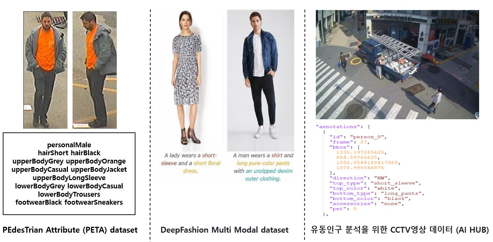
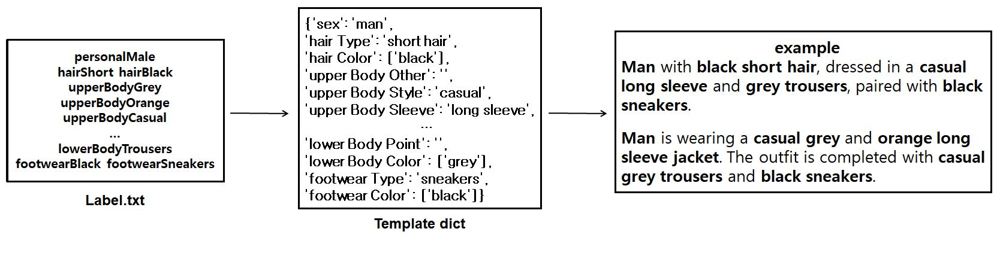
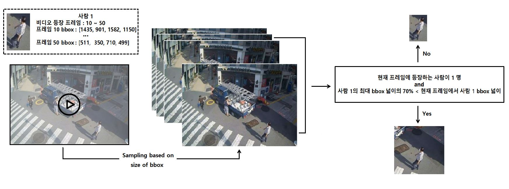

## 데이터 구조
```
|-- dataset root dir/
|   |-- prompt_config.json
|
|   |-- <PETA dataset>/
|       |-- SARC3D
|           |-- archive
|               |-- 001_right.bpm
|               |-- 001_front.bpm
|               |-- ...
|               |-- Label.txt
|
|       |-- ...
|
|       |-- 3DPeS
|           |-- archive
|               |-- 100_3_FRAME_26_RGB.bpm
|               |-- 100_4_FRAME_185_RGB.bpm
|               |-- ...
|               |-- Label.txt
|
|   |-- <deepfashion>/
|       |-- MEN-Denim-id_00000080-01_7_additional.jpg
|       |-- MEN-Denim-id_00000089-01_7_additional.jpg
|       |-- ...
|       |-- captions.json
|
|   |-- <AI_HUB_CCTV>/
|       |-- 2021-09-01_07-00-00_wed_rainy_out_do-sa_C0053-1_person_1.png
|       |-- 2021-09-01_07-00-00_wed_rainy_out_do-sa_C0053-1_person_2.png
|       |-- ...
|       |-- label.json
```

## 데이터 샘플
<p align="left">

</p>  

## 데이터 전처리
-  **Text(PETA, AI_HUB_CCTV)**
<p align="left">

</p>  

1. Label.txt와 label.json에서 template의 형식에 맞는 속성 값을 추출 
2. 완성된 template을 기준으로 빈 속성 값이 일정 갯수 이상되는 데이터를 제외
3. template의 속성 값을 조합하여 사전에 정의된 5개의 문장 형식을 무작위로 선택하여 prompt(caption) 완성 

위 텍스트 전처리 과정은 PETA, AI_HUB_CCTV 데이터에 대해서 적용하였고, 
deepfashion dataset은 이미 정의된 caption이 제공되기 때문에 기본적인 텍스트 전처리와 액세서리(반지, 목걸이 등)에 대한 설명이 포함된 데이터를 제거하는 전처리를 수행하였습니다.

-  **Image(AI_HUB_CCTV)**
<p align="left">

</p>  
위 그림은 AI_HUB_CCTV에서의 영상 데이터를 모델의 입력에 맞는 이미지 데이터로 샘플링 하는 과정으로, 이 video sampling 방식은 3분(3fps) 영상 데이터를 다루며, 총 540프레임의 영상에서 등장하는 사람을 모두 1프레임씩 샘플링 하도록 설계하였습니다.  <br><br>  

1. 사람 1을 기준으로 영상에서 사람 1이 등장하는 10~50프레임을 bbox의 넓이를 기준으로 내림차순으로 샘플링
2. 내림차순으로 정렬한 프레임을 순서대로 조회하여 조건에 부합하는지 검사
3. 조건이 참인 경우, bbox 중심 좌표를 기준으로 모델의 입력 크기(384x384)만큼 이미지 crop
4. 조건이 거짓인 경우, bbox 크기만큼 이미지 crop

```
# Example
cd dataset
python ../data/ai_hub_cctv_preprocess.py --video_dir ./ye-ma \
--prompt_config_path ./prompt_config.json \
--save_dir ./AI_HUB_CCTV
```

-  **Image(공통)**  
1. RandomRotation
2. RandomVerticalFlip
3. RandomHorizontalFlip
4. ColorJitter
5. GaussianBlur

- 데이터 사용 갯수

  |  | PETA | AI_HUB_CCTV | DeepFashion | Total |
  | :---: | :---: | :---: | :---: | :---: | 
  | train | 3,200 | 3,200 | 1,600 | 8,000 | 
  |  val  |  520  |  520  |   -   | 1,040 | 
  |  test |  280  |  280  |   -   |  560  | 

